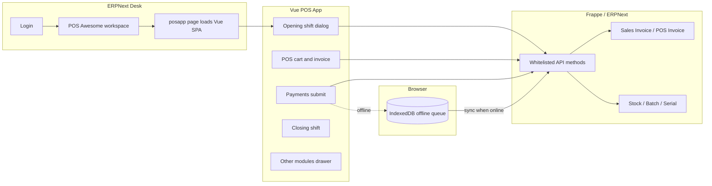

# POS Awesome — Overview, Architecture, and User Stories (Mobile Planning)

This document describes the **POS Awesome** Frappe app in this repository: what it does, how it is structured, how it talks to ERPNext, and **user stories** you can map to a native or hybrid mobile app.

---

## 1. What POS Awesome Is

**POS Awesome** is an open-source **Point of Sale (POS)** front end for **ERPNext v15**, built with **Vue.js** and **Vuetify**. It runs as a **Desk page** (`posapp`) inside a logged-in Frappe/ERPNext session—not as a standalone public website.

**Primary goal:** let retail staff sell quickly: pick items (barcode, search, card/list view), apply discounts and offers, take multiple payment modes, optionally work **offline**, and sync sales back to ERPNext as **Sales Invoice** or **POS Invoice** (configurable per POS Profile).

**Upstream / docs:** see the app [README.md](./README.md) and the [POS Awesome Wiki](https://github.com/yrestom/POS-Awesome/wiki) for installation and configuration details.

---

## 2. Technology Stack

| Layer | Technology |
|--------|------------|
| Platform | [Frappe Framework](https://github.com/frappe/frappe) + [ERPNext](https://github.com/frappe/erpnext) |
| POS UI | Vue 3 + Vuetify (under `frontend/src/posapp/`) |
| Built assets | `bench build --app posawesome` → `posawesome/public/dist/js/` |
| State / offline | IndexedDB + local storage (Dexie, custom offline modules under `frontend/src/offline/`) |
| Real-time | Frappe WebSocket (`frappe.realtime`) for server connectivity hints |
| Barcode / QR | Camera scanner with optional **OpenCV.js** in a Web Worker ([CAMERA_SCANNER_GUIDE.md](./CAMERA_SCANNER_GUIDE.md)) |
| Backend APIs | Python whitelisted methods under `posawesome/posawesome/api/` |

---

## 3. How Users Open POS Awesome

1. User logs into **ERPNext Desk**.
2. Opens workspace **POS Awesome** (module **POSAwesome**).
3. Clicks **POS Awesome App** → loads Desk **Page** `posapp` (title may show as “IBS POS” in `posapp.json`; UI branding uses POS Awesome).
4. **Roles** allowed to open the page (from `posapp.json`): Sales User, Sales Manager, System Manager, Accounts Manager, Accounts User.

**POS Profile** (standard ERPNext doctype, extended with many custom fields via fixtures in `hooks.py`) defines **which users** can use which register, warehouse, customer, payment methods, and dozens of behavior flags (offline, credit, returns, M-Pesa, etc.).

---

## 4. High-Level Application Flow

1. **Opening:** User selects POS Profile (and company); system creates/checks **POS Opening Shift** and loads full **POS Profile** + company + payment methods (`shifts.py`: `get_opening_dialog_data`, `create_opening_voucher`, `check_opening_shift`).
2. **Selling:** Items, taxes, offers, coupons, customer, delivery charges, multi-currency, batches/serials, variants, etc., are composed in the Vue POS; submission goes through invoice APIs (`invoices.py`, `invoice.py` hooks on Sales/POS Invoice).
3. **Payments:** Modes from profile; credit sales; customer credit; M-Pesa; optional “POS Awesome payments” flows (`payments.py`, `payment_entry.py`, `m_pesa.py`).
4. **Closing:** **POS Closing Shift** (from UI/menu) reconciles the session.
5. **Offline:** Cart can be stored locally; stock is adjusted in local cache rules; on reconnect, invoices sync (failures may become drafts—see README).

---

## 5. Main UI Modules (Navigation Drawer)

The shell is `Home.vue`, which swaps a dynamic page component. Drawer items (see `Navbar.vue`) map roughly to:

| Drawer label | Purpose |
|--------------|---------|
| **POS** | Main checkout: items, customer, discounts, offers, payments, opening/closing dialogs |
| **Sales Invoice** | List / work with sales invoices from POS context |
| **Purchase Invoice** | List, create (mini form), detail view for supplier purchases |
| **Customers** | Customer list / CRUD aligned with selling |
| **Suppliers** | Supplier list / CRUD for purchasing |
| **Payments** | Customer payments, reconciliation (profile-dependent) |
| **Sales Return** | Returns: cash, exchange, customer credit ([SALES_RETURN_GUIDE.md](./SALES_RETURN_GUIDE.md)) |
| **Print** | QR / print-related utilities |
| **Stock Entry** | List, create, detail for stock movements |
| **Items** | Item list, create (mini), item details |
| **Recipes** | POS Recipe master data and details |
| **Reports** | Summary and registers; **Recipe Usage** routes into Reports with props (`setPage("Recipe Usage", …)`) |
| **Recipe Usage** | Shortcut into Reports for usage analytics |

The top bar includes **status** (network/server), **cache usage**, optional **server/DB gadgets**, **offline invoice queue**, **sync**, **manual offline toggle**, theme, about, logout.

---

## 6. Configuration That Drives Behavior (POS Profile)

Many behaviors are gated by **custom fields** on **POS Profile** (installed via fixtures in `hooks.py`). Examples relevant to product design:

- **Selling:** allow edit rate/discount, partial payment, credit sale, sales order vs invoice, template items, serial/batch search, scale barcode, tax inclusive, multi-currency, delivery charges, print last invoice, draft print, posting date change.
- **Returns:** allow return, return without invoice, free batch return.
- **Offline:** `posa_local_storage`, `posa_use_server_cache`, `posa_server_cache_duration`, `posa_force_server_items`.
- **Payments:** M-Pesa reconciliation, “POS Awesome payments,” make/reconcile payments.
- **UX:** default card view, language (`posa_language`), camera scanning toggles.
- **Document type:** `create_pos_invoice_instead_of_sales_invoice` switches primary submission target.

For a **mobile app**, treat POS Profile as the **single source of feature flags** per register/user.

---

## 7. Backend API Surface (for Mobile Integration)

The frontend calls **`frappe.call({ method: "posawesome.posawesome.api....", args: {...} })`** and standard Frappe methods (e.g. `logout`, `frappe.client.get_list`, print URLs).

Whitelisted Python entry points are grouped in `posawesome/posawesome/api/`:

| Module | Typical responsibilities |
|--------|---------------------------|
| `utils.py` | `get_active_pos_profile`, `get_default_warehouse` |
| `shifts.py` | Opening shift data and voucher creation |
| `items.py` | Item search, barcodes, groups, stock-related fetches, counts |
| `item.py` | Additional item operations |
| `customers.py` | Customer CRUD, addresses, names, counts |
| `customer.py` / `customer_credit.py` | Validation hooks and credit helpers |
| `invoices.py` | Draft/submit/update/delete invoice, return search, validation |
| `invoice.py` (hooks) | Sales/POS Invoice validate/before_submit/before_cancel |
| `offers.py` | POS offers, coupons, delivery charges, gift coupons |
| `payments.py` | Payment requests, available credit |
| `payment_entry.py` | Extended payment/reconciliation flows |
| `m_pesa.py` | M-Pesa callbacks and operations |
| `sales_orders.py` | Search/update/submit sales orders from POS |
| `quotations.py` | Quotation update/submit |
| `sales_return.py` | Return workflows |
| `purchase_invoices.py` | Purchase invoice draft/submit/update/delete, cart validation |
| `suppliers.py` | Supplier CRUD and related |
| `stock_entry.py` | Stock entry helpers |
| `bundles.py` | Bundle components |
| `recipes.py` | Recipe components, usage by invoice/item |
| `reports.py` | `get_pos_summary`, `get_sales_register`, etc. |
| `utilities.py` | Translations, version, price lists, tax inclusive, app info |

**Mobile implication:** you can reuse the same methods via **authenticated HTTP** to `/api/method/...` if you implement Frappe session or token-based auth; the payloads mirror what the Vue app sends today.

---

## 8. Data Model Touchpoints (ERPNext + POS Awesome)

- **Standard ERPNext:** Sales Invoice, POS Invoice, Sales Order, Customer, Item, Batch, Serial No, Payment Entry, Stock Entry, Purchase Invoice, Company, POS Profile, POS Opening/Closing Shift, etc.
- **POS Awesome doctypes** (under `posawesome/posawesome/doctype/`): e.g. **POS Offer**, **POS Coupon**, **Referral Code**, **Delivery Charges**, **M-Pesa** registers, **POS Recipe** / **POS Recipe Item**, and link/reference doctypes.

Hooks in `hooks.py` attach **document events** to Sales Invoice, POS Invoice, and Customer so POS-specific validation and side effects run on save/submit.

---

## 9. Offline Mode (Conceptual)

- **Detection:** combines `navigator.onLine`, WebSocket/server checks, optional **manual offline** mode, and HTTPS hostname heuristics (`offline/sync.js`, `isOffline()`).
- **Persistence:** queues **offline invoices**, **offline payments**, **offline customers** with caps and health checks; uses **IndexedDB** and **localStorage**.
- **Stock:** local stock adjustments on save; sync reconciles with server; **Allow Negative Stock** in ERPNext Stock Settings affects strictness.
- **Sync:** when back online, queued work posts via the same invoice/payment APIs; user gets counts and draft-vs-submitted feedback (`syncOfflineInvoices` from `Home.vue`).

A mobile app would need a **similar queue** and conflict strategy if you want parity.

---

## 10. User Stories (for Mobile App Backlog)

Stories are written in **“As a … I want … so that …”** form, grouped by epic. Prioritize based on whether your mobile app is **cashier-only** or **full back-office**.

### Epic A — Access and session

- **A1:** As a **cashier**, I want to **log in securely** to my company’s ERPNext site so that I only see authorized data.
- **A2:** As a **cashier**, I want the app to **load my assigned POS Profile(s)** so that I use the correct warehouse, payments, and rules.
- **A3:** As a **cashier**, I want to **start an opening shift** with opening balances so that my register session matches store policy.
- **A4:** As a **cashier**, I want to **end / close shift** with reconciliation so that totals are handed over to accounting.

### Epic B — Core checkout

- **B1:** As a **cashier**, I want to **search items by name, code, barcode, batch, or serial** (as allowed by profile) so that I can add lines quickly.
- **B2:** As a **cashier**, I want to **scan barcodes/QR with the device camera** so that I do not type SKUs.
- **B3:** As a **cashier**, I want **list and card (image) views** so that I can choose a fast layout.
- **B4:** As a **cashier**, I want to **select variants** for template items so that the correct SKU and price apply.
- **B5:** As a **cashier**, I want **batch/serial capture** when required so that stock traceability is correct.
- **B6:** As a **cashier**, I want **scale/weighted barcodes** (where configured) so that deli-style items price correctly.
- **B7:** As a **cashier**, I want to **change quantity, rate, and discounts** within profile limits so that managers’ rules are enforced.
- **B8:** As a **cashier**, I want **tax-inclusive or exclusive pricing** to match the profile so that totals match the register.

### Epic C — Customer and pricing

- **C1:** As a **cashier**, I want to **select or create a customer** so that the sale is attributed correctly.
- **C2:** As a **cashier**, I want **customer-specific discount** when enabled so that loyal customers get the right price.
- **C3:** As a **cashier**, I want **multi-currency** sales with correct exchange rate so that tourists or foreign price lists work.
- **C4:** As a **cashier**, I want to **see and apply customer credit** as a payment method so that prior returns/credits are used.

### Epic D — Promotions and extras

- **D1:** As a **cashier**, I want **POS offers and promotional schemes** applied automatically or selectively so that campaigns work at the till.
- **D2:** As a **cashier**, I want to **apply POS coupons** so that discounts from marketing are honored.
- **D3:** As a **cashier**, I want **referral code** capture when the company uses referrals so that campaigns can be tracked.
- **D4:** As a **cashier**, I want **delivery charges** (including address-based rules when configured) so that delivery orders are priced correctly.

### Epic E — Payments and fulfillment type

- **E1:** As a **cashier**, I want to **split payments across modes** (cash, card, etc. per POS Profile) so that customers can pay flexibly.
- **E2:** As a **cashier**, I want **partial payment** when allowed so that deposits or split tenders work.
- **E3:** As a **cashier**, I want **credit sales with due date** when allowed so that trusted customers can buy on account.
- **E4:** As a **cashier**, I want **M-Pesa** payment and reconciliation when enabled so that mobile money matches store processes.
- **E5:** As a **cashier**, I want **enqueue submit after printing** when configured so that the receipt prints before background submission completes.
- **E6:** As a **cashier**, I want to **print or share a receipt** (native print/share on mobile) so that customers get proof of purchase.

### Epic F — Sales orders and quotations

- **F1:** As a **salesperson**, I want to **create or convert a Sales Order from POS** when the profile allows so that fulfillment can happen later.
- **F2:** As a **salesperson**, I want to **work with quotations** from the POS flows where implemented so that estimates convert to sales.

### Epic G — Returns

- **G1:** As a **cashier**, I want to **process a return with cash refund** so that the customer gets money back and stock is corrected.
- **G2:** As a **cashier**, I want to **exchange returned items for different items** so that net payment balances automatically.
- **G3:** As a **cashier**, I want to **issue customer credit** on return so that the amount applies to future purchases.

### Epic H — Purchasing and stock (secondary on mobile)

- **H1:** As a **store manager**, I want to **create/view purchase invoices** so that receiving matches supplier bills.
- **H2:** As a **store manager**, I want to **manage suppliers** so that purchasing data stays current.
- **H3:** As a **store manager**, I want to **create stock entries** and view details so that inventory adjustments are done on the floor.

### Epic I — Master data (lightweight mobile)

- **I1:** As a **manager**, I want to **browse and edit items** (within permissions) so that quick fixes do not require a desktop.
- **I2:** As a **manager**, I want to **browse/edit customers** so that contact and billing data stay accurate.

### Epic J — Recipes and reporting

- **J1:** As a **kitchen or F&B manager**, I want to **define POS recipes** and components so that usage can be tracked against sales.
- **J2:** As a **manager**, I want **simple POS reports** (sales totals, returns, purchases, sales register, recipe usage) for a date range so that I can monitor performance without Desk reports.

### Epic K — Offline and reliability

- **K1:** As a **cashier**, I want to **continue selling when the network drops** (if offline is enabled) so that the store does not stop.
- **K2:** As a **cashier**, I want **clear visibility of pending sync** and errors so that I know what failed.
- **K3:** As a **cashier**, I want **automatic sync when online** so that I do not manually re-enter sales.

### Epic L — Localization and accessibility

- **L1:** As a **user**, I want the UI in **my POS Profile language** (e.g. EN/AR/PT/ES) so that staff read labels comfortably.
- **L2:** As a **user**, I want **RTL layout** when using Arabic so that mirroring matches expectations.

---

## 11. Mobile App Planning Notes

1. **Auth:** Frappe typically uses cookie session from login; mobile often uses **OAuth/token** or **API key** patterns—confirm your bench security model before shipping.
2. **API parity:** Trace critical flows in Vue (`frappe.call` paths) and mirror argument shapes in your mobile client.
3. **Printing:** Web POS uses print URLs (`printview`); mobile may use **Bluetooth printers**, **PDF share**, or **email receipt**.
4. **Scanner:** Native ZXing/ML Kit may replace OpenCV.js; keep the same **barcode → item resolution** APIs (`get_items_from_barcode`, etc.).
5. **Real-time:** Optional for mobile; polling `/api/method/ping` or shift status may suffice for connectivity indicators.
6. **Scope:** A first mobile MVP often ships **Epics A, B (subset), C (subset), E (subset), K (optional)**; leaves H/J as future phases.

---

## 12. File Map (quick reference)

| Area | Path |
|------|------|
| Vue shell & routing by page | `frontend/src/posapp/Home.vue` |
| Navigation & menu | `frontend/src/posapp/components/Navbar.vue`, `navbar/*` |
| Main POS screen | `frontend/src/posapp/components/payments/pos/Pos.vue` |
| Offline core | `frontend/src/offline/*.js` |
| Python APIs | `posawesome/posawesome/api/*.py` |
| DocTypes | `posawesome/posawesome/doctype/*` |
| Hooks & fixtures | `posawesome/hooks.py` |
| Desk page | `posawesome/posawesome/page/posapp/` |
| Workspace | `posawesome/posawesome/workspace/pos_awesome/pos_awesome.json` |

---

*Generated from the codebase in this workspace to support a companion mobile application. For installation and feature lists, see [README.md](./README.md).*
